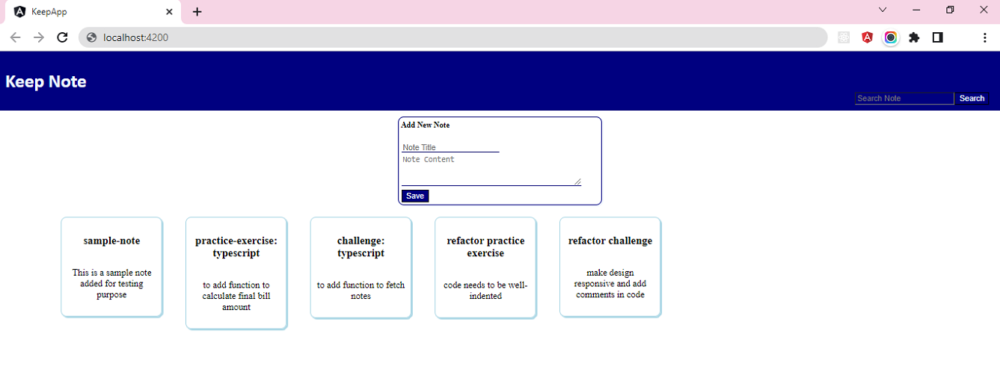

## Challenge - Keep Note

#### Context

Keep Note is a web app that allows user to maintain notes.  The app should be designed as a single page application.​

Based on SPA approach, the app should be developed by creating components.​

In the current phase of development, the app should read notes residing externally in the form of an array. The app should update this array, when user adds new notes.​

For the convenience, the app should provide search functionality to allow user to search notes by note title.​

The phase 1 of development is completed, whereby separate components are created to add, search and view notes.​

In phase 2 development, persistence should be implemented.​

By making HTTP calls to json-server, notes should be fetched from and saved in `notes.json` file located in `keep-note-data` folder.​

#### Task 1 - Create Note Service
- Reuse the `Keep-Note` solution build in challenge of previous sprint - `Sprint 3` 
- Create `NoteService` using Angular CLI command in services folder
    `ng generate service services/note` or `ng g s services/note`
- Inject HttpClient dependency in the service class through the constructor.
- Define URL property to store the request URL for communicating with `json-server` for accessing `notes` data from `notes.json` file. This file is located in the `keep-note-data` folder.
- Define `getNotes()` method to make HTTP request to the defined URL to fetch notes.
- Define `addNote()` method to make HTTP request to the defined URL to post note data to server. The data to be posted should be accepted as the parameter of this method.

#### Task 2 - Add Note
- Inject `NoteService` as the depedency in `NoteAddComponent` class.
- Modify the `addNote()` method in `NoteAddComponent` class.
- The method should call the `addNote()` method of the `NoteService` and call the `subscribe()` method on the observable returned.
- The `subscribe()` method should raise alert with message `Note Added` and emit `noteAdded` event with the note data added.
- The code should also handle error if the request returns with error response.

#### Task 3 - Fetch Notes
- Inject `NoteService` as the depedency in `NoteViewComponent` class.
- Implement `OnInit` interface with `ngOnInit()` lifecycle method in `NoteViewComponent` class.
- In the `ngOnInit()` method call the `getNotes()` method of `NoteService` to fetch notes data from server and update `notes` array property.
- The code should also handle error if the request returns with error response.
- The `NoteViewComponent` should listen to `noteAdded` event emitted by `NoteAddComponent` and associate the event handler method `onNoteAdded()` with the event.
- The `onNoteAdded()` method should accept the `note` data passed with the event and push it to the `notes` array.

#### Task 4 - Search Note
- Modify `onSearchTextChanged()` method which gets invoked when the `searchTextChanged` event is emitted by `Search` component.
- The method should call `getNotes()` method of `NoteService` and update the `notes` property with the filtered data if `searchText` is not empty else update the `notes` property with the data fetched.

**Note**
1. Style the components by defining CSS classes in their respective `.css` file for better look and feel.
2. The sample layout suggested for the `Keep Note` app is provided in the image below:

